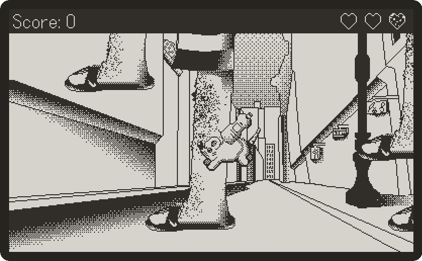

<div align="center">

<!-- TODO: title-card image here -->
<!--  -->

# Lost & Raturn — Playdate Edition

A rat on a mission to save the world — one lost item at a time.

[](LICENSE)


[](https://github.com/JohnnyMorganz/StyLua)

<!-- TODO: gameplay GIF -->
<!--  -->

</div>

## About

> **Status:** In development

A port of The Lost Rats' inaugural title — [Lost & Raturn](https://justinro-underscore.itch.io/lost-raturn) 
— for the [Playdate](https://play.date/) handheld.

The year is 1983, and the good people of the city have terminal butterfingers — 
they're dropping their belongings all over the place. Enter Marshall, the bravest 
of rats with the gravest of responsibilities: returning lost goods to their clumsy owners.

You'll scurry through the chaos of pedestrian foot traffic and shimmy up people's 
legs to hand back what they dropped — to the right person, mind you. After all, 
what would Marshall do with someone else's wallet? Just don't get squashed out there. 
Life is tough for a little rat.

Take on the challenge and beat your friends' scores!

## How to Play

| Control | Action            |
| ------- | ----------------- |
| D-Pad   | Move              |
| A       | Jump/Grab Leg     |
| B       | Pick up/Drop Item |
| Crank   | Climb Leg         |

### Objective

Return items dropped from pedestrians. Return the right items and you get points, 
give someone the wrong item and you lose points. Don't get stepped on or you will lose health!

## Gallery

| Delivering sunscreen to a swimmer                                                                  |
| :------------------------------------------------------------------------------------------------: |
|   |

## Development

### Requirements

- [**Playdate SDK**](https://play.date/dev/)

#### For formatting and type checking:
- Formatter: [**StyLua**](https://github.com/JohnnyMorganz/StyLua)
  - `brew install stylua`
- Type Checker: [**lua-language-server**](https://github.com/LuaLS/lua-language-server)
  - `brew install lua-language-server`

Recommended editor is **VS Code** with the workspace-recommended extensions 
(see `.vscode/extensions.json`).

### Getting Started

1. Clone this repo with submodules
```sh
  # Clone with submodules — the LuaCATS type defs live in library/ as a submodule
  git clone --recurse-submodules git@github.com:The-Lost-Rats/Lost-Raturn-Playdate.git
```

If you already cloned the repo without submodules, you can run this command:
```sh
  git submodule update --init --recursive
```

2. Ensure your PLAYDATE_SDK_PATH is set correctly
```sh
  # Point at your SDK (add to your shell profile to make it permanent - ~/.zshrc or ~/.bashrc etc.)
  export PLAYDATE_SDK_PATH="$HOME/MY_PATH/PlaydateSDK"
```

### Building & Running

#### Option A: VS Code playdate-debug Extension
With the installed extensions, you can hit **F5** in VS Code to build and launch the 
playdate simulator with your current code. This will launch the simulator in debug mode 
which will allow you to add breakpoints to your code!

#### Option B: Makefile
Alternatively, the Makefile exposes helper commands to allow you to run the following 
from the CLI:
```sh
  make build     # compiles source/ -> LostRaturn.pdx via pdc
  make run       # builds, then opens in the Playdate Simulator
  make clean     # removes the build output
```

#### Option C: Manually
Lastly, you can always compile directly with `pdc source LostRaturn.pdx` and open the 
compiled file with the playdate simulator.

### Development Workflow

#### Formatting & Type Checking

The Makefile also exposes the commands for validating and formatting the code:
```sh
  make validate  # Validate formatting and type checking
  make format    # Format files
```

If you want to run these commands manually they are:
```sh
stylua source/          # format
stylua --check source/  # verify formatting

lua-language-server --check .   # type-check; run from the repo root
```

### Project Structure

```
Lost-Raturn/
├── source/                       # game code + assets
│   ├── main.lua                  # entry point: builds scenes, runs the frame loop
│   ├── pdxinfo                   # game metadata (name, author, etc.)
│   ├── images/
│   ├── scenes/                   # Game Scenes
│   ├── scripts/
│   │   ├── ScoreManager.lua
│   │   ├── player/
│   │   ├── walker/
│   │   ├── item/
│   │   └── ui/
│   └── utilities/
│       ├── constants.lua         # cross-cutting constants + enums
│       └── math.lua              # small math helpers
├── library/                      # LuaCATS type defs (git submodule)
├── .luarc.json                   # lua-language-server config
├── .stylua.toml  .styluaignore   # formatter config
├── .editorconfig                 # shared whitespace rules
└── Makefile
```

### Contributing

- **Branches:** `<type>/<short-desc>` — e.g. `feat/crank-climb`, `fix/stomp-hitbox`
  (Conventional Commits types)
- **Commits:** [Conventional Commits](https://www.conventionalcommits.org/)
- **Before a PR:** run `make validate` and `make format` — both should be clean.

## License

The **source code** in this repository is licensed under the [MIT License](LICENSE).

The **game assets** — all art, audio, level/design data, and the "Lost & Raturn"
name and characters — are **© 2026 The Lost Rats, All Rights Reserved**, and are
**not** covered by the MIT license. You may not redistribute or reuse the assets
without permission.

---

<div align="center">
© 2026 The Lost Rats
</div>
